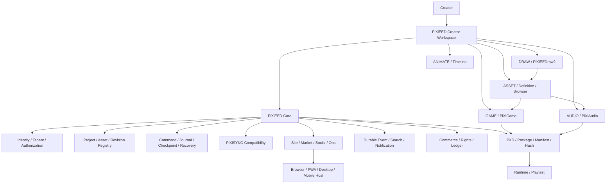
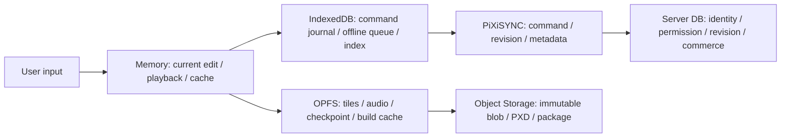
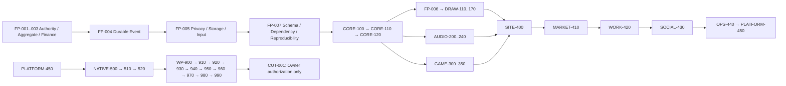

# PiXiEED 学習用・全体Context

```yaml
context_id: PIXIEED-LEARNING-CONTEXT-001
version: 1.0.0
status: LEARNING_CONTEXT
updated_at: 2026-08-16
repository: /Users/tsukadareine/Documents/GitHub/PiXiEED
current_package: SOCIAL-430
current_package_status: IN_PROGRESS
core_completion_authority: CORE-120
qualification_entry: WP-900
cutover: CUT-001_EXPLICIT_OWNER_AUTHORIZATION_REQUIRED
```

## 0. この文書の目的

この文書は、PiXiEEDの全体像、設計理由、ロードマップ、実装の入口、実際のコードの使い方、
ユーザー体験、検証方法、Agent運用を一度に学習するためのContextです。

これは新しい仕様の正本を増やすための文書ではありません。個別仕様と矛盾した場合は、下記の
Canonical文書を優先します。ここは「全体を理解するための地図」として使い、変更は必ず対応する
正本・契約・ADR・テストにも反映します。

```text
ユーザー指示
  > AGENTS.md / docs/codex-workflow-notes.md
  > LATEST_CANONICAL_DECISIONS.md / WORK_PACKAGE_REGISTRY.json
  > Roadmap / Architecture / Product Spec / Contract / ADR
  > 実装・Test・Evidence（現在存在するものの証拠）
  > 旧Prompt・旧Context・履歴資料（参考のみ）
```

最初に読む入口は次です。

- [Canonical決定インデックス](LATEST_CANONICAL_DECISIONS.md)
- [Work Package Registry](WORK_PACKAGE_REGISTRY.json)
- [完成Roadmap](../09_ROADMAP/PIXIEED_COMPLETION_ROADMAP.md)
- [Agent Execution Framework](../09_ROADMAP/AGENT_EXECUTION_FRAMEWORK.md)
- [Core Architecture](../02_ARCHITECTURE/PIXIEED_CORE_SYSTEM.md)
- [Storage and Sync](../02_ARCHITECTURE/STORAGE_PLACEMENT_AND_SYNC.md)
- [Draw2 UX正本](../03_PRODUCTS/PIXIEEDRAW2_UX_SPEC.md)
- [実務Workflow Notes](../docs/codex-workflow-notes.md)

---

## 1. PiXiEEDは何を作っているか

### 1.1 結論

PiXiEEDは、PiXiEEDraw2だけを作るプロジェクトではありません。

> **PiXiEEDstudioを共通の制作入口に、iDRAW・iAUDIO・iGAME、Market・Social・配布を一つの制作体験へ接続する、サイト全体のCreator Platformです。**

PiXiEEDraw2、PiXiEEDraw、PiXiGame、PiXiAudio、PiXFiND、Marketなどは、同じProject／Asset／Revision／
Permission／Eventの契約を共有する専門Moduleです。ユーザーからは一つのCreator Workspaceに見えますが、
内部では責務を分離し、必要なModuleだけを読み込みます。

```text
PiXiEED Platform
├─ PiXiEEDstudio（共通の制作入口）
│  ├ Identity / Account / Tenant / Permission
│  ├ Project / Asset / Revision / Dependency / Provenance
│  ├ Command / Operation / Journal / Checkpoint / Recovery
│  ├ PiXiSYNC compatibility and future sync
│  ├ PXD / Package / Manifest / Hash / License
│  ├ Event / Activity / Search / Notification
│  ├ Market / Purchase / Entitlement / License / Royalty / Ledger
│  ├ App Shell / Route / Feature Flag / Rollback
│  └ Observability / Evidence / Qualification
├─ Creator Workspace
│  ├ DRAW: PiXiEEDraw2
│  ├ ANIMATE: Timeline / Frame / Cel / Onion Skin
│  ├ ASSET: Asset Definition / Browser / Live Reference
│  ├ GAME: PiXiGame authoring and playtest
│  ├ AUDIO: PiXiAudio authoring and playback
│  └ EXPORT: PXD / PiXiPackage / Sprite Sheet / external formats
├─ Site / Community
│  ├ Account / Project / Asset / Search / Notification
│  ├ Market / Direct Work / Rights / Commerce
│  ├ Social / Community / Creator / Moderation
│  └ Ops / Analytics / Ads / Support
└─ Distribution
   ├ Browser / PWA (first and fallback)
   ├ Desktop native candidate (NATIVE-500 → NATIVE-510)
   └ Mobile stores through Capacitor (NATIVE-520)
```

### 1.2 ONE PROJECT / ONE WORKSPACE / MULTIPLE SPECIALIZED MODES

Draw・Game・Audioを別ページへ移動して状態を切断するのではなく、同じProjectを保ったままModeを
切り替えます。

```text
DRAW
  描く → Revision
    ↓
ANIMATE
  Frame / Cel / Tag / Playback
    ↓
ASSET
  Layer × Frame × Region × AnimationをDefinition化
    ↓
GAME
  Registered AssetをScene / Entityへ配置
    ↓
AUDIO
  BGM / SFX / MarkerをGameやTimelineへ割り当て
    ↓
EXPORT
  PXD / PiXiPackage / Runtime / Market用Package
```

Modeを切り替えても再生成してはいけないものは、Project、Canvas/Raster、Layer、Frame、Cel、Timeline、
Undo/Redo、PXD State、PiXiSYNC Stateです。交換するのはPresentation Treeだけです。

---

## 2. 全体Architecture



### 2.1 境界の基本

| 境界 | 権威 | 持つもの | 持たないもの |
|---|---|---|---|
| Project Registry | Project identity authority | ID、owner、membership、visibility、lifecycle、head/root refs | Pixel、Audio、Game blob、Journal本体、決済 |
| Asset Registry | Asset/Revision identity authority | Asset ID、Revision、hash、size、MIME、locator、dependency、provenance | Blob bytes、License、Royalty、Purchase、Entitlement |
| Tool Bridge | host-neutral reference boundary | ID、Revision、Definition digest、consumer | Pixel/Raster/Blob/Base64、完全PXD |
| PXD | ユーザーが開く編集原本 | Project、Draw、Asset Definition、refs、history、dependency、license/provenance | PXDを毎回巨大な単一Blobとして更新する実装上の強制 |
| Runtime | 再生・実行 | lock済みartifact、scene、input、audio、runtime state | Editor UI、Registry解決、Project編集State |
| Workspace State | 個人の表示状態 | panel、dock、tab、zoom、scroll、active local tool | PiXiSYNC canonical operation、Project内容 |

---

## 3. Storageと同期をどう考えるか

「全部IndexedDB」でも「毎回巨大PXDを書き直す」でもありません。データの性質ごとに分けます。



### 3.1 保存先

- **Memory**: 現在のRaster編集、選択、直近Undo/Redo、Canvas/Preview Cache、Playback。
- **IndexedDB**: Command Journal、未同期Operation、Checkpoint管理情報、Project/Asset Index、最近のProject、Offline Queue、小さなMetadata。
- **OPFS**: 大きな画像Tile、Pixel Chunk、Audio Blob、Waveform、Game Build Cache、Preview Cache、大容量Checkpoint。
- **Supabase/Server DB**: Account、Project Metadata、Permission、Confirmed Revision、Asset Graph、Market、Purchase、Entitlement、License、Royalty、Ledger、SNS、Search、Notification。
- **Object Storage**: PXD/PiXiPackage、PNG/GIF、Audio、Game Package、immutable Asset Blob、Thumbnail、Backup。

### 3.2 操作の流れ

```text
Pointer Stroke
  → Memoryへ即時反映
  → 1 Stroke = 1 Command / 1 Undo
  → IndexedDBへJournal
  → 変更TileだけOPFSへ保存
  → Checkpoint
  → 必要なCanonical OperationだけPiXiSYNCへ同期
  → Content HashでBlobを必要時だけUpload
```

大きなデータを毎回Server DB行へ入れません。DBはID、Revision、Hash、Storage Locator、権限などを持ち、
実体BlobはObject Storage/OPFSへ置きます。

---

## 4. PXDの意味

`.pxd`は「絵だけのファイル」ではなく、**PiXiEED制作Projectを再編集するための正式コンテナ**です。

```text
Adventure.pxd
├ Project / ID / Metadata / Version
├ Draw / Canvas / Palette / Layers / Groups
├ Frames / Cels / Timeline / Tags / Selection / Settings
├ AssetDefinitions / source layers / regions / animation clips / pivots / locks
├ Audio References / Game References / Asset Graph
├ Revision / History / Recovery / Checkpoints
├ PiXiSYNC metadata / Dependencies
├ License / Provenance
└ Preview / Thumbnail
```

ユーザー視点では一つのPXDですが、編集時の内部実装はIndexedDB＋OPFS＋サーバー参照＋Object Storageに
分割してよいです。Backup、移動、販売、共有、Export時に論理PXDまたはPiXiPackageとしてMaterializeします。

PXDと次の形式は同一ではありません。

- PXD: 編集原本・Project/Asset Definitionコンテナ
- PiXiPackage: 配布・販売・実行に必要な依存とLicenseを固定したPackage
- PNG/GIF/Sprite Sheet: 画像出力
- WAV/OGG/MIDI: Audio出力
- Game Build: Runtimeへ渡す実行成果物

---

## 5. Asset DefinitionとRegistry Bridge

Assetは画像コピーではなく、PXD内の参照定義です。

```text
PXD Canvas / Layers / Frames
        ↓ source reference
Asset Definition
  ├ Layer selection: current / selected / group / visible
  ├ Frame selection: current / range / tag / explicit
  ├ Region: full / manual / 16×16 / 32×32 / custom grid
  ├ Animation: Idle / Walk Up/Down/Left/Right / Attack / Custom
  ├ Pivot: center / feet / custom
  ├ Protection: lock / source read-only / LIVE/PINNED/REVIEW/FORKED
  └ Metadata / dependency
        ↓
LOCAL_DRAFT
        ↓ validate
VALIDATED_DEFINITION
        ↓ server-authorized registration
REGISTERED_ASSET
        ↓
Game / Audio / Market / Cross Project
```

`LOCAL_DRAFT`をGame、Audio、Marketへ流してはいけません。未登録Assetはfail-closedです。
RegistryへPixel/Raster/Blob/Base64を複製しません。Registryは「このPXD内のこのDefinitionを、全体から
どう参照するか」を管理します。

### 5.1 参照モード

- `LIVE`: 最新Revisionを追従。制作Preview向け。
- `PINNED`: 特定Revisionを固定。公開・販売済みVersion向け。
- `REVIEW`: 更新を検出するが承認後に適用。
- `FORKED`: 元Assetから独立分岐。

### 5.2 実コードの入口

実装は [pixiedraw2/src/draw2-creator-workspace.ts](../pixiedraw2/src/draw2-creator-workspace.ts) と
[pixiedraw2/src/draw2-asset-registry-bridge.ts](../pixiedraw2/src/draw2-asset-registry-bridge.ts) にあります。

```ts
import {
  createCreatorWorkspaceState,
  transitionCreatorWorkspaceMode,
  createAssetDefinitionDraft,
  validateAssetDefinitionDraft,
} from "./draw2-creator-workspace.ts";

const drawState = createCreatorWorkspaceState();
const assetModeState = transitionCreatorWorkspaceMode(drawState, "ASSET");

const draft = createAssetDefinitionDraft({
  sourceProjectId: "project-001",
  sourceCanvasId: "canvas-main",
  sourceKind: "SELECTED_LAYERS",
  sourceLayerIds: ["layer-body", "layer-hair"],
  frameStart: 1,
  frameEnd: 4,
  assetKind: "CHARACTER",
  pivot: "FEET",
});

if (!draft.ok) throw new Error(draft.code);
const validated = validateAssetDefinitionDraft(draft.value);
if (!validated.ok) throw new Error(validated.code);
// validated.valueは外部Consumerへ渡せるが、登録前はまだREGISTERED_ASSETではない。
```

Registry BridgeはProviderを受け取り、callerが`trusted: true`や`allowed: true`を渡して権限を作る設計では
ありません。

```ts
import { createAssetRegistryBridge } from "./draw2-asset-registry-bridge.ts";

const bridge = createAssetRegistryBridge(serverAuthorizedProvider);
const registered = await bridge.register(validated.value, {
  projectId: "project-001",
  sourcePxdId: "pxd-001",
  definitionId: "hero-definition",
  ownerId: "creator-001",
  referenceMode: "LIVE",
});

if (!registered.ok) {
  // LOCAL_DRAFT、identity mismatch、provider failure等は拒否する。
  throw new Error(registered.code);
}
// registered.valueはAsset ID / Revision / digestを持つ参照Identityのみ。
```

### 5.3 Dirty Region

元Canvasが変わったときに全Assetを再合成しません。

```text
Canvas command
  → dirty region
  → sourceProjectId / canvasId / regionの依存検索
  → 交差したDefinitionだけinvalid
  → 必要になった時だけ再materialize
```

---

## 6. Creator WorkspaceのUX基準

### 6.1 Desktop

目的はDashboardではなく、密度のあるProfessional Creative Applicationです。

```text
┌──────────────────────────────────────────────────────┐
│ Project / Mode / Save / Undo / Redo / Preview / Menu │
├────────┬───────────────────────────────┬─────────────┤
│ Tool   │                               │ Color       │
│ Rail   │           Canvas              │ Layers      │
│        │        (viewport only)        │ Inspector   │
│        │                               │ Assets      │
├────────┴───────────────────────────────┴─────────────┤
│ Timeline / Frames / Cels / Tags / Markers / Audio     │
└──────────────────────────────────────────────────────┘
```

- AsepriteのPixel Art操作効率、Timeline、Palette、Shortcutを最低基準にする。
- Unity/Unreal/Figma/Adobe/CLIP STUDIO等はDock、Inspector、Asset Browser、Panel組織の参考にする。
- コピーではなくPiXiEED Core、Realtime、Game/Audio連携へ適合させる。
- Canvasは主役。Canvas内部へ説明テキストや不要Panelを置かない。
- Menu、Shortcut、Command Palette、Help、QAから全機能を発見できる。
- アイコン中心。ただし破壊・公開・課金・権利など高リスク操作はアイコンだけにしない。
- ボタンサイズと可変ハンドルは統一し、過度な丸角・過剰な余白・装飾Borderを避ける。
- Panelはresize、collapse、hide、tab grouping、workspace presetへ拡張可能にする。

### 6.2 Mobile portrait

現行PiXiEEDrawの縦型Canvas-first体験を参考にします。ただし、PiXiEEDrawの実装を密結合でコピーせず、
同じCoreへPiXiEED専用Presentationとして接続します。

```text
Header Rail
  ↓
Tool Rail（常時到達）
  ↓
Canvas（最大領域）
  ↓
Color palette（常時到達）
  ↓
Context tabs / sheets（Tool / Timeline / Layer / More）
```

- 44px以上のTouch Target。
- 1本指は描画。2本指はPan/Pinch Zoom。ジェスチャーを相互排他にする。
- Timeline、Layer、Color編集などは必要なときだけSheet/Tabとしてmountする。
- Desktopの全Panelを縮小して同時表示しない。
- Page/document scrollは0。Scrollが必要ならそのPanel内部だけにする。
- Safe Area、Browser UI、Text Scaling、IME、Reduced Motionを考慮する。

### 6.3 Tablet

TabletはDesktopの縮小でもMobileの拡大でもなくAdaptive Workspaceです。

- Landscape: Compact Dock（Canvas中央、Tool左、必要Panel右、Timelineは必要時）。
- Portrait: Mobile寄りCanvas-first、Context Sheet/Side Sheet。
- `ResizeObserver`と`matchMedia`はrequestAnimationFrameで統合する。
- Desktop/Tablet/Mobileの重いDOMを3つ同時mountしてCSSで隠さない。
- Profile変更でRaster、Project、Layer/Frame/Cel、Undo、PXD、PiXiSYNCを再生成しない。

### 6.4 画面内スクロール規則

Shellは`100dvh`＋Safe Area内に収め、ページ全体の縦横スクロールを発生させません。
長いTimeline、Layer、Asset一覧だけが自身のViewport内でscroll/virtualizeします。

### 6.5 実UIのコード入口

主要なHTMLは [pixiedraw2/index.html](../pixiedraw2/index.html)、Styleは
[pixiedraw2/assets/draw2-shell.css](../pixiedraw2/assets/draw2-shell.css)、Iconは
[pixiedraw2/assets/icons/draw2-icons.svg](../pixiedraw2/assets/icons/draw2-icons.svg) です。

実際の入口には次のようなSurfaceがあります。

- `#draw2WorkspaceTabs`: Color、Layers、Inspector、Tools、Play、Assets、Export
- `#draw2BrushSize`, `#draw2BrushPattern`, `#draw2BrushShape`, `#draw2BrushOpacity`
- `#draw2MirrorMode`, `#draw2PaletteWheel`
- `#draw2TimelineTabs`: Timeline、Tags、Markers、Audio
- `#draw2TimelineViewport`, `#draw2TimelineWindow`
- `#draw2Canvas`, `#draw2Overlay`, `#draw2PixelGrid`, `#draw2SelectionOverlay`
- `#draw2MirrorGuideOverlay`, `#draw2TimelineLayerProperties`

---

## 7. Draw2の制作体験と機能基準

PiXiEEDraw2の「コードがある」だけでは完成ではありません。ユーザー操作として成立することが必要です。

### 7.1 基本操作

- Pencil / Eraser / Fill / Eyedropper。
- Rectangle、filled rectangle、circle、filled circle、ellipse、filled ellipse。
- Selection: rectangle、free、same color、similarity、add/subtract/intersect、move、transform。
- Selectionの確定・キャンセル・解除。変更がある場合の安全な確定。
- Move、Rotate、Flip、Nearest-neighbor Scale。
- Brush size、shape、pattern、dither、custom brush、preset、opacity。
- Palette、HSV map、Hue wheel、recent color、hex、alpha。
- Layer visibility、lock、opacity、blend（normal/multiply/add/burn等）。
- Frame/Cel、Layer×Frame Timeline、Tags、Playback、FPS、Loop/Once/Ping-pong。
- Linked Cel、Onion Skin（実色モード、赤/青順序モード）、Mirror/Symmetry、Grid/Guide。
- Tile、Slice、9-Slice、Sprite Sheet/Atlas、Pivot、Game Metadata。
- Reference image、Navigator、mini preview、virtual cursor。
- PXD/PNG/GIF/Sprite Sheet/Package export、Legacy PXD Adapter。

### 7.2 Pixel表示

- CanvasはNearest-neighbor／Pixel Perfect。CSS全ページズームではなくViewport projectionをズームする。
- ズームはポインター位置を基準にし、ズームアウト時は自然に中心へ戻せる。
- 背景Checkerは32px単位（現行方針）。Canvas PixelのCanonical ColorとThemeを混ぜない。
- 1px Minor Grid、8px Major Grid。Grid、Major、Selection、MirrorのOverlayはRasterへ焼き込まない。
- SelectionはCanvas Pixelへ描かず、SVG/Overlayで表示する。
- Brush previewは実際にクリックしたときの色・形・サイズ・patternを表示する。
- 円・楕円・線は決定的な整数Pixelアルゴリズムを使い、端切れ・重複・ブラウザ差を避ける。
- Mirror lineはCanvas外まで伸ばし、移動・ズームで崩れず、各軸のON/OFFを持つ。

### 7.3 Timeline

TimelineはLayer Name HeaderとFrame Number Headerの交差を司令塔とし、Layer×Frame×Celを1:1セルで表示します。

- Layer rowにvisibility toggle、lock、active indication。
- Frame番号を上段へ固定し、frame 1の初期オフセットをゼロ基準で測定。
- 左上の操作は再生/一時停止（1枠）、Frame複製、Loop（OFF/LOOP/PING_PONG）を基本にする。
- Cell clickでactive Layer/Frame/Celを切り替え、作成直後も描画可能にする。
- TimelineタブはTimeline、Tags、Markers、Audio。将来の要素は同じTab Railへ追加。
- 1000 Frames、100 Layersへvirtualize。visible、overscan、mounted数を測る。
- Hidden TimelineやPanelはCel全体、Thumbnail、Animation、翻訳を更新しない。
- Timeline再描画のたびにDOM全体を翻訳しない。翻訳済みlabelまたはkey-based textを生成時に入れる。

### 7.4 Performanceの根本原則

Pointer StrokeごとにTimeline、Layer、Palette、Inspector、Workspace全体を再renderしません。
Canvas/Input Hot PathとWorkspace Projectionを分離します。WorkerはBenchmarkで利益が確認された大きな処理
だけに使い、Pointer描画を無条件にWorker往復させません。

過去のSafari収録で、CanvasではなくTimeline/i18n経路がPage MemoryとMain Threadを急増させた事例があります。
`renderTimeline → translateDraw2Subtree → translateDraw2Text`のようなDOM全走査をHot Pathへ戻さないことを重要な回帰規則とします。

---

## 8. Security / Authority / Transactionの学習ポイント

### 8.1 Server Authority

権限をcaller ObjectやBooleanで決めません。

```text
Authenticated Principal
  → Tenant Membership
  → Server-owned Context
  → AuthorizationProofV1
  → resource / action / capability拘束
  → domain operation
```

`principal mismatch`、`tenant mismatch`、`resource mismatch`、`action mismatch`、expired、unknown policy、
fake/clone/spread/Proxy/JSON化されたProof、古いRevisionは拒否します。

### 8.2 Financial Integrity

金額、通貨、recipient、royalty rate、entry typeをcaller入力から直接受け取りません。

```text
Verified Provider Event
  → Canonical Purchase / Payment
  → Product / License / Fee Schedule
  → CanonicalMoney
  → Royalty Allocation
  → Ledger Entry
```

共同作品ではContributor Snapshotを販売時に固定し、必要な控除後の残額を決定論的に均等分配します。
Product Leadは販売管理者であってRevenue Ownerではありません。完全に同じProduct Fingerprintだけ重複拒否し、
ゲーム、OST、素材集、編集可能Packageなど内容が違うProductは許可します。

### 8.3 Durable Event

FP-004は、正しいFinancial/Authority stateを耐久化するための基盤です。

- Outbox / Inbox
- Transaction boundary
- Idempotency key
- Provider Event identity
- duplicate / replay / out-of-order / crash recovery
- lease / stale / revoke

イベントを保存するだけでなく、二重Ledger、古いMembershipでのSettlement、malformed successを成功扱いしないことが必要です。

---

## 9. Canonical Roadmap

これは実行命令ではなく、依存関係と完成判定の全体図です。



### 9.1 Completion level

1. `CORE_COMPLETE`: Core contract、authority、command、event、storage、package、conformanceを独立Review済み。
2. `PRODUCT_COMPLETE`: Draw2、Audio、Gameが essential capability、Undo/Recovery、UX、A11y、性能を満たす。
3. `USER_WORKFLOW_COMPLETE`: Golden Projectで作成、保存、Preview、Link、Package、Recoveryを実証。
4. `RELEASE_QUALIFIED`: WP-900〜WP-990でSecurity、Compatibility、Device、Performance、Staging、Rollbackを実証。
5. `CUT-001`: Production Cutover。Ownerの明示承認があるまで別境界としてBlocked。

### 9.2 Package catalog

| 系列 | Package | 役割 |
|---|---|---|
| Foundation/Core | FP-004 / FP-005 / FP-007 / CORE-100 / 110 / 120 | 信頼境界、耐久イベント、Hardening、再現性、Core Gate |
| Draw2 | FP-006 / DRAW-110..170 | Pixel制作、Selection、Timeline、Export、Legacy、Preview、Advanced UX |
| Audio | AUDIO-200..240 | Project/Track/Clip、Waveform、Playback、MIDI、Mixer、Game assignment |
| Game | GAME-300..350 | Scene、Entity、Input、Collider、Animation、Behavior、Playtest、Runtime qualification |
| Platform | SITE-400 | Server-authorized Registry Providerの最小実経路 |
| Commerce | MARKET-410 | Product/Rights/Commerce boundary。現行Marketを変更しない |
| Work | WORK-420 | Direct Work aggregate。実本番取引を行わない |
| Social | SOCIAL-430 | Social/Community/Creator統合。現在の作業Package |
| Operations | OPS-440 / PLATFORM-450 | Search/Notification/Moderation/Ops/統合運用 |
| Native | NATIVE-500 / 510 / 520 | Host境界、Desktop配布候補、Capacitor mobile store候補 |
| Qualification | WP-900..WP-990 | Release Readiness、横断、実機、性能、互換、Security、Staging、Rollback、Owner判断 |
| Cutover | CUT-001 | 本番切替。明示Owner authorizationのみ |

### 9.3 Golden Projects

- `DRAW_GOLDEN_PROJECT`: 64×64、multi-layer/frame、Selection、Onion Skin、Palette、PXD round-trip。
- `AUDIO_GOLDEN_PROJECT`: BGM/SFX、Waveform、Marker、Mixer、Game assignment、offline/reconnect。
- `RPG_GOLDEN_PROJECT`: Scene、Tile、Player/NPC、Input、Dialogue/Quest、No-code、Save。
- `ACTION_GOLDEN_PROJECT`: Animation、Hit/Hurt、Input buffer、SFX、Pause、deterministic preview。
- `CROSS_TOOL_GOLDEN_PROJECT`: Draw＋Audio＋Game＋Asset Graph＋Package＋Runtime。

### 9.4 最初の縦切り

```text
Draw → Revision → Preview
Audio → Game
Draw + Audio + Game → Package → Runtime
Product → Purchase → Entitlement → License → Ledger
Direct Work → Rights
Published Work → Search → Notification
```

---

## 10. 現在のCanonical状態（2026-08-16）

```yaml
current:
  work_package: SOCIAL-430
  status: IN_PROGRESS
  context: .codex/context/SOCIAL-430.md
  context_sha256: 99ef42018fd768c69a36c16277970205a7696936afe89781b0a8ab5375611df0
  qualification_ready: false
  core_completion: CORE-120
  next_catalog_package: OPS-440
  auto_start_next: false
  boundary_ownership: APPROVED
```

### 10.1 保護済み領域

- Creator Workspace Foundation: `COMPLETE_CANDIDATE / PROTECTED`
- Asset Definition: `COMPLETE_CANDIDATE / PROTECTED`
- Registry Bridge: `COMPLETE_CANDIDATE / PROTECTED`
- SITE-400: bounded vertical slice `COMPLETE_CANDIDATE / PROTECTED`
- MARKET-410: isolated composition boundary `COMPLETE_CANDIDATE / PROTECTED`
- WORK-420: bounded Direct Work composition `COMPLETE_CANDIDATE / PROTECTED`
- GAME-350: native contract scope `COMPLETE_CANDIDATE`。Browser、実機、Native、Staging資格は未完。

### 10.2 いま未完・未実測として維持するもの

- SOCIAL-430の現在作業と独立Review。
- Production Auth、DB、RLS、RPC、Provider adapter接続。
- Production Deploy、Production performance、Migration、Rollback rehearsal。
- 実ユーザーのLegacy PXD／User data compatibility。
- 物理Mobile/Tablet、Stylus、長時間Memory、Safari/Firefox（実行していないもの）。
- Desktop signing、notarization、updater、native rollback。
- App Store / Google Playへの提出・公開。

「コードが存在する」「Synthetic TestがPASS」「Desktop browserが開く」はRelease Readyを意味しません。
実測していないものは必ず`UNTESTED`のままにします。

### 10.3 Baseline

```text
Baseline total: 77
Passed: 63
Inherited failures: 14
New failure identities: 0
Evidence: docs/inventory/baseline-results.json
Identity = Test name + target file + major Error Signature
```

14件は既存Baselineとして保持します。同じ14件だけなら既存不一致のまま、新しいTest名・対象File・Error Signatureが
増えたら新規回帰です。件数だけで判定しません。

---

## 11. 実装・テストの実務入口

### 11.1 Repository map

```text
pixiedraw2/
├ index.html
├ assets/draw2-shell.css
├ assets/icons/draw2-icons.svg
├ src/draw2-core.ts
├ src/draw2-entry.ts
├ src/draw2-basic-tools.ts
├ src/draw2-viewport.ts
├ src/draw2-pixel-grid.ts
├ src/draw2-selection.ts
├ src/draw2-selection-edit.ts
├ src/draw2-timeline.ts
├ src/draw2-export.ts
├ src/draw2-legacy-compat.ts
├ src/draw2-i18n.ts
├ src/draw2-shortcuts.ts
├ src/draw2-settings.ts
├ src/draw2-creator-features.ts
├ src/draw2-creator-workspace.ts
├ src/draw2-asset-registry-bridge.ts
├ src/core/core-100..120/
├ src/fp-004/ src/fp-005/ src/fp-006/ src/fp-007/
├ src/server/
├ src/audio/audio-200..240/
├ src/game/game-300..350/
└ src/platform/site-400/ market-410/ work-420/ social-430/
```

Testsは`pixiedraw2/tests/`、Benchmarkは`pixiedraw2/benchmarks/`、Evidenceは`docs/inventory/`、契約は
`docs/contracts/`、判断は`docs/decisions/`です。`pixiedraw2/dist/`は生成Bundleであり、手編集しません。

### 11.2 よく使う検証

```bash
# Repository root
python3 scripts/verify_work_package_context.py \
  --context .codex/context/SOCIAL-430.md \
  --manifest .codex/context/SOCIAL-430.manifest.json

deno fmt --check pixiedraw2/src/platform/social-430 pixiedraw2/tests/social-430 pixiedraw2/benchmarks/social-430
deno check --no-remote pixiedraw2/src/platform/social-430/*.ts
deno test --no-remote --allow-read --allow-write pixiedraw2/tests/social-430

python3 scripts/validate_pixieed_program.py --root .
node scripts/verify-canonical-package-alignment.mjs
node scripts/test-baseline-failure-identity-wp080.mjs
node scripts/test-baseline-suite-wp000.mjs
git diff --check
```

実際のPackageでは、Contextに記載された固定Commandを優先し、存在しないglobや推測したCommandを追加しません。
Preflight、Evidence validator、独立ReviewのExit Code、Artifact Hash、Reviewerを別々に記録します。

ローカルブラウザ確認は次です。

```bash
node scripts/static-server.mjs
# http://localhost:8000/pixiedraw/
# http://localhost:8000/pixiedraw2/
```

表示確認ではScreenshotだけでなく、`getBoundingClientRect()`、`scrollWidth/clientWidth`、
`scrollHeight/clientHeight`、DOM node数、Observer/listener増殖、JS Heap、Main Thread、Panel内scrollを測ります。

### 11.3 証拠の扱い

```text
Source / static check
  ≠ isolated test
  ≠ synthetic fixture
  ≠ browser smoke
  ≠ real device qualification
  ≠ production qualification
```

どのEvidenceも対象範囲を越えて昇格させません。`UNTESTED`は欠陥の隠蔽ではなく、次のGateに残した正確な状態です。

---

## 12. Agent運用（学習用の標準）

### 12.1 役割

- **SOL MAX**: 常駐Coordinator。読み取り専用。Canonical、依存、Harness、Evidence、Dirty baseline、Write Scopeを照合し、Luna/Terraへ完全な指示を出す。製品Source、Test、Production、Commitを直接変更しない。
- **Luna MAX**: 標準Implementation Agent。RegistryのWrite Scope内で実装、Test、修正、Evidence、Handoffまで一つのPackageとして進める。
- **Terra High**: 独立Reviewer。実装と同じ前提を再利用せず、Sourceから再確認し、攻撃Fixture、Evidence、Browser/実機の未実測を監査する。Terraが実装した場合は別Reviewerを必須とする。

### 12.2 コストと速度

大量Fan-outは速さではありません。次の順で効率を上げます。

```text
SOL: 正本・依存・Scope・Acceptanceを一度照合
  ↓ 一つの完全なDispatch
Luna: 依存する修正・Test・Evidence・文書更新をまとめて実行
  ↓ 依存しないScopeだけ bounded parallel
Terra: 独立再監査
  ↓
SOL: 結果をCanonicalへ反映し、次Packageを自動開始せず停止
```

- 並列は書込みPathが完全に分離した最大4トラック程度に限定。
- 同じFile、同じTest、同じ検証を並列化しない。
- 完了Agentはレポート後に終了する。
- Agent一覧やChat履歴はApplication stateであり、RepositoryのContextやHarnessを編集しても消えない。アプリ側の履歴削除はUIの管理操作で行う。
- SOL routeは一度だけread-only probeし、以後同じ設定で繰り返さない。
- 次Packageを自動Startしない。`READY`、Context、Independent Review、Owner boundaryを確認してから次へ進む。

### 12.3 Agentへ渡す標準指示

```text
あなたは指定Packageの担当です。

1. AGENTS.md、docs/codex-workflow-notes.md、LATEST_CANONICAL_DECISIONS、Registry、Roadmap、
   対象Package Contextを先に読む。
2. allowedWriteGlobs以外を変更しない。現行Route、PXD、PiXiSYNC、Market、Production data、
   Auth/DB/RLS/Storage、購入権、License/Royaltyを変更しない。
3. 依存Packageを再実行しない。差分は対象Scopeだけに限定する。
4. 実装、対象Test、失敗修正、再Test、Evidence、差分Reviewを一つの作業単位で行う。
5. 実測していないものをPASSと書かない。未実測はUNTESTEDと記録する。
6. Baselineは件数ではなくTest名・対象File・主要Error Signatureで比較する。
7. Production Migration、Deploy、Publish、Commit、Push、Cutover、Store Submitは行わない。
8. 最終報告に変更File、Command/Exit Code、Evidence Hash、未解決、次Packageを記載する。
```

---

## 13. 失敗しないための学習原則

1. **Core完成とProduct完成とRelease完成を混同しない。** CORE-120がPASSでもDraw2/Audio/Gameの実機・横断・運用が未完ならProduct/Releaseは未完。
2. **完成Candidateと実証済みを分ける。** `COMPLETE_CANDIDATE`は境界の実装と隔離検証が揃った状態であり、本番接続や実機資格を意味しない。
3. **Authorityはサーバーから導出する。** CallerのBoolean、trusted object、古いObject、BrowserのProvider差し替えを信頼しない。
4. **PXDは論理原本、Storageは物理配置。** ユーザーの分かりやすさと高速な内部差分保存を両立する。
5. **Live ReferenceはRevisionで制御する。** 制作PreviewはLIVE、公開済みはPINNED、Review/Forkを明示する。
6. **UIはCoreのAuthorityではない。** Panel crashはProject corruptionではなく、Workspace projectionを再生成・復旧する。
7. **必要なPresentationだけmountする。** CSSで全Profile・全Panelを隠すだけにしない。
8. **性能は測ってから直す。** Dominant hot pathを一つ特定し、behavior-preservingな変更を一つ入れ、再測定する。
9. **Evidenceは範囲を越えて昇格させない。** Local、Synthetic、Browser、Device、Productionを別レベルで記録する。
10. **既存システムを守る。** 新しいPiXiEEDは旧PiXiEEDraw、PXD、PiXiSYNC、Market、URL、購入権、Production DB/Storageを守りながら切り替える。

---

## 14. 完成までの最終イメージ

```text
現行PiXiEEDを保護
  ↓
Core contracts / authority / events / storage / reproducibility
  ↓
Draw2 / Audio / Gameを各単体でProduct Complete
  ↓
Draw → Asset → Game / Audio → Package → RuntimeをGolden Projectで実証
  ↓
Site / Market / Direct Work / Social / OpsをServer Providerとつなぐ
  ↓
Browser / PWA / Desktop candidate / Mobile candidateを資格化
  ↓
WP-900〜WP-990で横断・実機・性能・互換・Security・Staging・Rollback
  ↓
OwnerへRelease Decisionを提出
  ↓（明示承認後のみ）
CUT-001 Production Cutover
```

この順番の目的は、機能を増やし続けることではなく、**Coreを一度決め、各Toolを同じProject/Asset/Revisionへ
安全につなぎ、実ユーザーの制作から配布までを証明すること**です。

## 15. 次の読み方

現在は`SOCIAL-430`が`IN_PROGRESS`です。次のPackageはRegistry上では`OPS-440`ですが、自動開始しません。
SOCIAL-430のContext、Write Scope、Evidence、Terra独立Review、Baseline identityを閉じてから、Registryと
新しいContextを再生成します。

```text
このContextを読む
  → 現在Stateを読む
  → Work Package Registryを読む
  → 対象Contextを読む
  → 対象コードとTestを読む
  → 実装/検証
  → Terra独立Review
  → Handoff / Checkpoint
```

**この文書単体で、実装済み・本番接続済み・Release済みとは判断しないでください。**
