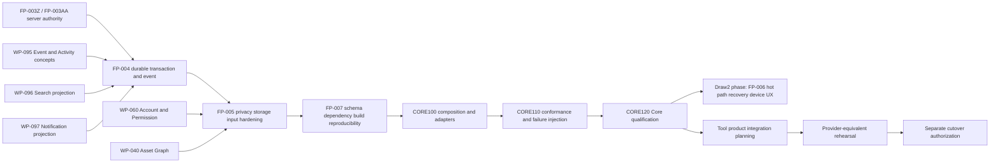

# Core Completion Blueprint

Status: CANONICAL BLUEPRINT / CONTRACT-ONLY
Updated: 2026-08-10
Scope: Core completion before any new tool-product production integration

## 1. Implementation truth

The new Core is currently an isolated/reference implementation. `core-shell/`, `pixiedraw2/`,
the new Core adapters under `pixiedraw/assets/js/modules/`, and the WP-210 through WP-250
projections are not the current production execution path.

The current production paths remain separate: `pixiedraw/`, the existing Market and Social
pages, the existing PiXiSYNC path, existing Admin/Ads paths, and the existing Supabase
functions/migrations. A source file, generated `dist` artifact, passing synthetic test, or
contract document is not evidence of production integration.

This blueprint uses the following labels on every completion claim:

| Label | Meaning |
| --- | --- |
| `IMPLEMENTED_ISOLATED` | Source exists and is intentionally isolated from production. Tests may be synthetic or local only. |
| `CONTRACT_ONLY` | Behavior, schema, boundary, or acceptance condition is documented, but the required durable/runtime implementation is not complete. |
| `PRODUCTION_INTEGRATED` | The current production route loads or invokes the path and its production provider boundary is known. This does not imply live deployment is verified. |
| `UNTESTED` | Required browser, device, provider, live-data, failure-injection, or qualification evidence is absent. |

## 2. Boundary rules

| Boundary | Owns | Must not claim |
| --- | --- | --- |
| Core | Canonical IDs, validation, authorization inputs, state/event contracts, durable transaction semantics, projections, diagnostics | UI product behavior, provider credentials, raw blobs, payment execution, production cutover |
| Tool product | Draw2, Audio, Game, Market, Direct Work, SNS, Admin, and other user-facing workflows | Canonical authority, provider identity, arbitrary event publication, bypassing Core qualification |
| Provider adapter | Auth, database, object storage, queue, email/push, search backend, Stripe, and other external transports | Replacing Core validation, inventing authorization, accepting malformed success, deciding cutover |
| Production-equivalent | Isolated environment with provider-shaped Auth/DB/RLS/Storage/queue behavior and reproducible data fixtures | Being called production, changing production rows, migrating production schema, using production secrets |
| Cutover | Separately approved rollout, cache/version identity, migration sequencing, shadow comparison, rollback, owner approval | Being implied by a Core test, a local build, or a source import |

The existing WP-095 contract is the conceptual starting point for FP-004. Its current Pure Core
implementation uses an in-memory Outbox and Synthetic Transaction Adapter. That proves a boundary,
not durability. See [`02_ARCHITECTURE/EVENT_ACTIVITY_CORE.md`](EVENT_ACTIVITY_CORE.md) and
[`docs/contracts/WP-095-EVENT-ACTIVITY.md`](../docs/contracts/WP-095-EVENT-ACTIVITY.md).

## 3. Completion layers and dependency order

The Core completion order is intentionally different from the product-package order. FP-006 is
not a Core completion layer; it moves to the Draw2 phase after CORE120.

### Layer FP-004 — Durable transaction and event

Status: `CONTRACT_ONLY`

Complete the contract in [`docs/contracts/FP-004-DURABLE-EVENT.md`](../docs/contracts/FP-004-DURABLE-EVENT.md).
The implementation must provide an atomic state-plus-outbox commit, durable Inbox acceptance,
provider event identity, idempotency conflict handling, per-aggregate ordering/gap handling,
retry/DLQ, replay without side effects, crash-point tests, concurrency leases, authorization
revalidation, and malformed-success rejection.

Required evidence:

- durable adapter tests against a production-equivalent transaction boundary;
- duplicate, conflict, gap, retry, poison, lease-expiry, crash-before-commit, crash-after-commit,
  crash-before-ack, and replay evidence;
- explicit Finance, Notification, and Search consumer contracts;
- proof that the current WP-095 in-memory adapter is not being counted as durable;
- no production DB, Storage, queue, provider credential, or current route connection.

### Layer FP-005 — Privacy, storage, and input hardening

Status: `CONTRACT_ONLY`

Define and implement the storage-placement and privacy boundary for Memory, IndexedDB, OPFS,
database, and object storage. Enforce payload size/depth, raw blob and active-content rejection,
PII/secret exclusion, retention/quota rules, tenant/resource authorization, RLS/Storage-shaped
failures, and safe error redaction.

Required evidence:

- malformed and adversarial payload matrix;
- storage-placement conformance tests;
- authorization recheck and tenant-isolation tests;
- object locator/hash/size validation without reading arbitrary provider content;
- production-equivalent provider tests, still without production connection.

Reference: [`02_ARCHITECTURE/STORAGE_PLACEMENT_AND_SYNC.md`](STORAGE_PLACEMENT_AND_SYNC.md),
[`02_ARCHITECTURE/ACCOUNT_PERMISSION_CORE.md`](ACCOUNT_PERMISSION_CORE.md), and
[`02_ARCHITECTURE/ASSET_GRAPH.md`](ASSET_GRAPH.md).

### Layer FP-007 — Schema, dependency, and build reproducibility

Status: `CONTRACT_ONLY`

Make every Core schema, contract version, generated artifact, dependency, and build input
reproducible. Pin dependencies, establish source-to-dist provenance, validate schema compatibility,
and make the qualification bundle repeatable from a clean checkout without relying on `latest`
package ranges or unstated local state.

Required evidence:

- schema registry and compatibility matrix;
- deterministic build manifest and artifact hashes;
- dependency lock and vulnerability/license review record;
- generated `dist` provenance for every browser entry;
- clean-environment check and repeat-build comparison.

Reference: [`02_ARCHITECTURE/BUILD_EXPORT_PIPELINE.md`](BUILD_EXPORT_PIPELINE.md) and
[`app-shell/pixieed-capacitor/package.json`](../app-shell/pixieed-capacitor/package.json).

### Layer CORE100 — Composition and adapters

Status: `CONTRACT_ONLY`

Compose the completed FP-004/005/007 boundaries into one Core composition root. Every external
provider must enter through an injected adapter. Core must own validation, authorization inputs,
transaction decisions, event identity, idempotency, and projection rules; adapters must own only
transport and provider-specific serialization.

CORE100 must include:

- one canonical request/context path based on FP-003Z and FP-003AA;
- one durable transaction/outbox/inbox composition path;
- adapter capability declarations and fail-closed unsupported operations;
- Finance, Notification, and Search consumers behind separate interfaces;
- current-path fallback and default-off feature flags;
- no import or script-loading change to current production pages.

### Layer CORE110 — Conformance and failure injection

Status: `CONTRACT_ONLY`

Run the same conformance suite against in-memory, production-equivalent, and deliberately failing
adapters. Failure injection is mandatory at every durability boundary and must prove that a retry
or replay cannot create a second financial, notification, search, or provider side effect.

CORE110 must cover authorization loss, malformed provider success, duplicate provider delivery,
idempotency conflict, aggregate gap, stale version, lease theft, transaction rollback, process
crash, outbox dispatch pause, DLQ, replay, schema mismatch, privacy rejection, and unsupported
provider capability.

### Layer CORE120 — Qualification

Status: `CONTRACT_ONLY`

Qualify the complete Core as an isolated, reproducible, production-equivalent-tested platform
boundary. Qualification requires evidence, not only source presence:

- all FP-004/005/007 and CORE100/110 gates pass;
- implementation and contract inventories agree with the source graph;
- browser entry and generated artifact identity are reproducible;
- current production routes remain unchanged and continue to be the fallback;
- security, privacy, rollback, and owner approval records exist;
- all device/product-provider gaps are explicitly marked `UNTESTED`.

Only after CORE120 may the Draw2 phase begin. FP-006 then covers Draw2 hot path, recovery,
device UX, real data compatibility, and performance qualification. It is not a prerequisite to
implementing the durable Core, and its tests must not be used as Core durability evidence.

## 4. Dependency DAG

## 5. Product sequencing after Core

Tool products may consume Core only through the CORE100 interfaces after CORE120. They must not
ship provider calls directly from isolated projections. In particular:

- WP-210 Market rights remains a projection until Core qualification and a separately tested
  Market provider adapter exist;
- WP-220 Direct Work remains a contract/projection until durable commission and payment boundaries
  are separately authorized;
- WP-230 Social remains a contract/projection until explicit share commands and privacy gates are
  connected;
- WP-240 Admin/Analytics/Ads and WP-250 Economics remain shadow projections until provider,
  retention, consent, financial, and moderation boundaries are qualified;
- the existing production Market, Social, Admin, Ads, PiXiSYNC, and Stripe paths remain unchanged
  and are not silently replaced.

## 6. Rollback and non-cutover rule

Core completion must be reversible. Stop flags, dispatcher, or consumer independently; preserve
accepted Inbox/Outbox records; do not delete or mutate the current production path; and use an
explicit compensating command or isolated replay plan for recovery. No layer in this document
authorizes migration, deployment, publication, commit, push, production DB access, production
Storage access, or production credentials.
