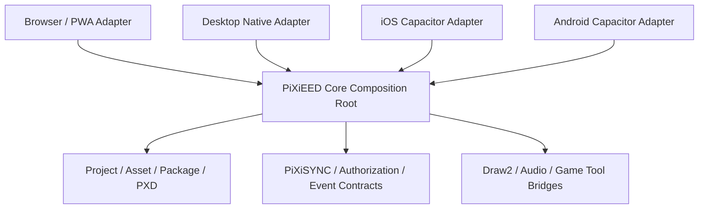

# Native App Shell Strategy

Status: IMPLEMENTATION STRATEGY / NO FRAMEWORK ADOPTION
Updated: 2026-08-10

## 1. Objective

PiXiEED will be built Browser-first, then hosted through thin native shells where that improves
installation, filesystem access, lifecycle handling, and distribution. The shell is a host, not
a second product implementation. Canonical Core, Project/PXD, Asset/Revision, PiXiSYNC,
authorization, diagnostics, and commerce contracts remain shared.



## 2. Shared boundary

Every host must implement the same typed `HostAdapter` boundary from
[`03_PRODUCTS/PIXIEED_APP_DISTRIBUTION_SPEC.md`](../03_PRODUCTS/PIXIEED_APP_DISTRIBUTION_SPEC.md).
Host code may handle permissions, lifecycle, window/safe-area, filesystem, notifications,
share/open-with, and deep links. It may not:

- mutate canonical Project State directly;
- invent a PXD/PiXiSYNC schema;
- accept caller-controlled authorization, payment, entitlement, royalty, or ledger values;
- bypass Core validation or durable transaction rules;
- load arbitrary navigation URLs or expose an unrestricted native bridge;
- fork Draw/Audio/Game business logic by platform.

Every Host Adapter reports a usable viewport after window chrome, browser UI, safe-area, keyboard,
and system bars. Editor `document`/root scroll is forbidden on Browser, Desktop Native, iOS, and
Android; only registered panel/sheet content may scroll or virtualize. Native menu and mobile
command sheet use the same command IDs, accessible names, shortcut/help metadata, and high-risk
confirmation rules as the Browser Workspace.

Capability detection and adapter contract tests are mandatory. Unsupported capabilities return a
typed `UNAVAILABLE`/`PERMISSION_DENIED` diagnostic, not a fake success.

## 3. Browser/PWA first

The Browser adapter is the reference host for Core and tool development:

- active editing state remains in memory;
- structured journal/index/offline queue uses IndexedDB;
- large tiles, media, and caches use OPFS where supported;
- server authority and Object Storage remain behind provider adapters;
- PWA install is additive and never replaces the current route;
- browser limitations are represented as capabilities, not hidden platform branches.

The current production `pixiedraw/` route remains preserved. New Draw2/Core entries stay
isolated and default-off until the established qualification gates authorize a route change.

## 4. Existing mobile shell: Capacitor reuse

`app-shell/pixieed-capacitor/` is the current mobile shell candidate and should be reused as the
initial iOS/Android host adapter boundary. Existing paths include:

- `package.json` and `capacitor.config.json`;
- `ios/` and `android/` native projects;
- `scripts/stage-web-assets.mjs` for `dist/web/` staging;
- Android/iOS doctor, archive, export, and debug/release helper scripts;
- `@capacitor/filesystem` for a future scoped StorageLocator adapter.

Reuse does not mean release-ready. The current shell still needs pinned dependencies, clean
source-to-artifact provenance, secure bridge review, permissions, deep links, share/open-with,
background recovery, store policy review, real-device evidence, and rollback rehearsal.

Mobile presentation remains a separate adaptive workspace: portrait Canvas-first current
PiXiEEDraw reference, contextual bottom sheets/drawers, safe-area handling, no desktop dock
shrink. Core identity and commands do not branch.

## 5. Desktop Native decision gate

Desktop Native is a future site-direct distribution candidate. No framework is adopted in this
strategy. The comparison gate must evaluate at least:

| Candidate | Bundle/startup | Memory | Security/isolation | Updater/rollback | Filesystem/window | Maintenance |
| --- | --- | --- | --- | --- | --- | --- |
| Tauri | Measure clean and packaged builds | Measure idle/editor/long session | Review WebView/native command boundary and CSP | Verify signed updater and rollback | Verify scoped file/dialog/protocol support | Review Rust/native maintenance and team fit |
| Electron | Measure clean and packaged builds | Measure Chromium process cost and long session | Review preload/context isolation/sandbox | Verify signed updater and rollback | Verify file association/protocol/menu support | Review larger runtime and dependency surface |
| Capacitor desktop | Verify actual desktop support and maturity | Measure packaged editor session | Verify desktop bridge/security boundary | Verify updater/signing support | Verify desktop file/window behavior | Confirm maintenance/community fit |
| Other/native | Only if a concrete requirement demands it | Evidence required | Evidence required | Evidence required | Evidence required | Owner approval required |

The gate must produce a decision record, benchmark manifest, threat model, proof-of-concept
artifact, and rollback rehearsal. “Modern” or “small bundle” alone is not an acceptance reason.

Site-direct Desktop distribution requires:

- macOS Developer ID signing and notarization;
- Windows code signing and installer/update signature verification;
- signed auto-update metadata, staged channels, pause/kill switch, and rollback artifact;
- stable file association and custom protocol allowlist;
- crash recovery without Project corruption;
- sandbox/permission boundary and explicit user-selected file access;
- offline/open-with/deep-link tests and uninstall/upgrade preservation tests.

## 6. Mobile distribution sequence

The primary public mobile routes are App Store and Google Play. Use TestFlight and Play internal
or closed tracks for staged qualification, then limited rollout, then public release after owner
approval. PWA remains the fallback and browser development host.

```text
Adapter contract
 -> simulator/emulator smoke
 -> physical device matrix
 -> TestFlight / Play internal
 -> closed/limited rollout
 -> rollback rehearsal
 -> public store approval
```

Store submission is a later release action. This worker does not submit or publish anything.
Direct APK or ad-hoc iOS distribution is not the primary public path; it may be considered only
for controlled testing or a separately approved enterprise/developer channel.

## 7. Security implementation rules

- Native bridge methods are explicit, typed, minimal, and versioned.
- Web content navigation uses an allowlist of origins/routes; custom protocols verify scheme,
  host, payload, and signed/authorized Project reference before opening.
- CSP, context isolation, origin checks, message size/depth limits, and error redaction are
  acceptance tests.
- Secrets, JWTs, emails, raw Project content, private commissions, audio/pixels, and payment
  data never enter telemetry or audit logs.
- Native Keychain/Keystore stores credentials only. Project data follows Core storage placement.
- Native lifecycle transitions flush journal/checkpoint through the same idempotent Core path.
- A failed permission or unavailable host capability is visible and recoverable; it is never
  reported as a successful export/open/save.

## 8. Required implementation phases

1. `NATIVE-500`: capability/adapter contract and host-neutral test doubles.
2. `NATIVE-510`: Desktop framework comparison and signed distribution prototype; framework still
   remains unselected until owner gate.
3. `NATIVE-520`: Capacitor iOS/Android adapter qualification, TestFlight/Play rehearsal, and
   store-policy evidence.
4. Later staging/release work packages: limited rollout, monitoring, rollback, and owner release.

None of these phases authorizes production route replacement, Core contract fork, migration,
deployment, store submission, commit, or push.

## 9. Completion evidence

Each native phase is incomplete until it has a machine-readable manifest containing source hash,
host capabilities, adapter contract result, artifact hash, dependency versions, security checks,
device/OS/browser matrix, failure-injection results, and explicit `UNTESTED` entries.

Mandatory failures include stale/deep-linked Project rejection, malformed PXD rejection, partial
write recovery, offline conflict, duplicate notification, bridge method injection, navigation
escape, token leakage, update signature mismatch, rollback failure, and host capability denial.
