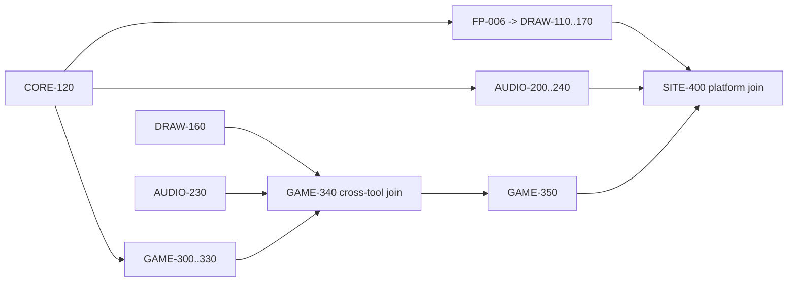

# PiXiEED Completion Roadmap v2

```yaml
roadmap_id: PIXIEED-COMPLETION-ROADMAP-002
schema_version: 2
registry: 00_START_HERE/WORK_PACKAGE_REGISTRY.json
current_ready_package: SITE-460
core_completion: CORE-120
```

This document remains the package catalog, dependency authority, and single Product Completion roadmap.
Its Product Completion overlay unites Core completion, Draw/Audio/Game capability, Golden Projects, user
workflows, and release qualification. The overlay does not reorder or start packages.

## Catalog and dependency gates

`FP-004 -> FP-005 -> FP-007 -> CORE-100 -> CORE-110 -> CORE-120 -> FP-006 -> DRAW-110 -> DRAW-120 -> DRAW-130 -> DRAW-140 -> DRAW-150 -> DRAW-160 -> DRAW-170 -> AUDIO-200 -> AUDIO-210 -> AUDIO-220 -> AUDIO-230 -> AUDIO-240 -> GAME-300 -> GAME-310 -> GAME-320 -> GAME-330 -> GAME-340 -> GAME-350 -> SITE-400 -> MARKET-410 -> WORK-420 -> SOCIAL-430 -> OPS-440 -> PLATFORM-450 -> NATIVE-500 -> NATIVE-510 -> NATIVE-520 -> WP-900 -> WP-910 -> WP-920 -> WP-930 -> WP-940 -> WP-950 -> WP-960 -> WP-970 -> WP-980 -> WP-990 -> CUT-001`

The line above is stable catalog/reporting order, not a serial execution command. Every package stops after
its own Checkpoint and independent review. Foundation and Core are serial dependency gates. After CORE-120,
the independent Draw2, Audio, and Game foundations are dispatched together and join only at declared
cross-tool gates.

## Product completion overlay

This is an extension of the single Roadmap, not a second roadmap. Completion has four distinct levels:

1. `CORE_COMPLETE`: Core contracts, authority, command, event, storage, package, conformance, and independent review.
2. `PRODUCT_COMPLETE`: Draw2, PiXiAudio, and PiXiGame each support the essential user capabilities, undo/recovery,
   responsive workspace, accessibility, errors, and measured performance.
3. `USER_WORKFLOW_COMPLETE`: Golden Projects can be created, saved, previewed, linked, packaged, and recovered.
4. `RELEASE_QUALIFIED`: WP-900..WP-990 provide security, compatibility, device, performance, staging, rollback,
   and owner-decision evidence. `CUT-001` remains separately authorized.

Core completion must not be reported as product or release completion. The current Core completion authority is
`CORE-120`; `OPS-440` and `PLATFORM-450` are now `COMPLETE_CANDIDATE` at their isolated semantic boundaries, and the next
candidate is `SITE-460` for browser-site connection and it is now a `COMPLETE_CANDIDATE` at local-browser scope. Boundary Ownership is approved, so GAME-350 remains a
`COMPLETE_CANDIDATE` for its native contract scope, SITE-400 remains a `COMPLETE_CANDIDATE` for its bounded
server-authorized Registry Provider vertical slice, MARKET-410 is `COMPLETE_CANDIDATE` for its isolated
Market/Rights/Commerce composition boundary after independent bounded review, and WORK-420 remains a
`COMPLETE_CANDIDATE` for the bounded Direct Work aggregate composition, and SOCIAL-430 is now a
`COMPLETE_CANDIDATE` for its isolated Social/Community/Creator boundary. SOCIAL-430 has three acceptance
rows PASS and Terra structural review PASS, while production semantic qualification remains PENDING/UNTESTED.
OPS-440 has three semantic-boundary acceptance rows PASS; the Terra final-audit history retained one
`FIX_REQUIRED` P1 document-whitespace finding, which Luna remediated and SOL verified. Production
Auth/DB/RLS/Storage, current-route activation, real provider/payment execution, and downstream packages
remain out of scope until their own evidence gates are met. PLATFORM-450 has three isolated acceptance rows
and remains production/browser PENDING_UNTESTED. SITE-460 local browser acceptance is complete; production,
provider, database, and native qualification remain PENDING_UNTESTED. Native/Store work remains deferred and
no package starts automatically; further progression requires Owner decision or an explicit next handoff.

### Product workspace canon

- Desktop: dense Aseprite-level pixel workflow with dock/Inspector/asset organization as structural references from
  Unity/Unreal/Figma, one primary viewport, Tool Rail, Right Dock, and Bottom Timeline/Sequencer/Graph/Mixer.
- Tablet: adaptive workspace; landscape is compact dock, portrait is Canvas-first with a contextual Side/Bottom Sheet.
- Mobile: current PiXiEEDraw portrait Canvas-first presentation; Tool and Color remain reachable, Timeline/Layer use
  tab or sheet presentation when not primary.
- All profiles use one Core and one Project/PXD meaning. Workspace state is local and never becomes a PiXYNC
  canonical operation. No document/page scroll; scrolling is confined to owning panels and virtualized lists.
- Menu, Shortcut, Command Palette, Help, QA enumeration, and high-risk actions use the versioned Command Registry.

### Current PXD owner decision (2026-08-18)

- `PXD` is the sole portable Project file for Draw + Audio + Game.
- The retired PiXiPackage separation is not a future implementation target.
- PXD v1 remains a Draw compatibility input; the integrated Project archive is PXD v2
  under the same `.pxd` extension.
- Modules remain independently stored and independently recoverable inside the PXD
  contract. This keeps normal autosave/startup light while allowing a PXD drop to be
  inspected and later converted into a locked Marketplace Product revision.
- A PXD may also carry multiple lightweight local Product candidate definitions. Each
  candidate selects modules, Draw Asset Definitions, Audio revisions, animation clips,
  rights intent, and an optional limited-edition quantity without copying payload bytes.
  Price, owner, entitlement, and publication remain server-owned later boundaries.
- “Package” in the existing product rows means a PXD module/product revision boundary,
  not a second user-facing project-file format.

### Product minimums

| Product | Completion minimum |
| --- | --- |
| Draw2 | Pixel tools, selection/transform, Palette/Color, Layer×Frame×Cel, Timeline/Onion Skin/Tags, playback, mirror/grid, PXD/PNG/package export, Legacy Adapter, undo/recovery, device UX |
| PiXiAudio | Project/Track/Clip/Waveform, trim/split/fade, playback/loop/tempo, marker, piano roll/MIDI, mixer/effects, package/license, safe Game assignment |
| PiXiGame | Scene/Hierarchy/Entity/Component/Prefab, Asset/Tile/World, Input, Collider/Physics, Animation, Behavior IR, No-code/Graph/Code, Playtest/Debug/Profiler, Save/Build/Package |
| Site/Commerce | Project/Asset/Product/Purchase/Entitlement/License, Direct Work aggregate, Royalty/Ledger, SNS/Search/Notification, preservation and rollback |

### Golden Projects and vertical slices

The completion evidence uses fixed isolated fixtures, never Production data:

| Golden Project | Purpose |
| --- | --- |
| `DRAW_GOLDEN_PROJECT` | 64×64 multi-layer/frame pixel project, selection, onion skin, palette, PXD round-trip |
| `AUDIO_GOLDEN_PROJECT` | BGM/SFX, waveform, markers, mixer, Game assignment, offline/reconnect |
| `RPG_GOLDEN_PROJECT` | Scene, Tile, Player/NPC, Input, Dialogue/Quest, No-code, Save |
| `ACTION_GOLDEN_PROJECT` | Animation frame data, Hit/Hurt, input buffer, SFX, pause, deterministic preview |
| `CROSS_TOOL_GOLDEN_PROJECT` | Draw + Audio + Game + Asset Graph + Package + Runtime |

The first vertical slices are Draw→Revision→Preview, Audio→Game, Draw+Audio+Game→Package→Runtime,
Product→Purchase→Entitlement→License→Ledger, Direct Work→Rights, and Published Work→Search→Notification.
Each slice records source revisions, hashes, expected events, recovery steps, and evidence level.

### Canonical consolidation rule

Do not create `NEW_ROADMAP`, `FINAL_ROADMAP`, `CREATOR_ROADMAP`, or another general completion authority.
Extend this document when the detail is roadmap-wide; use `WORK_PACKAGES/` for package scope, `02_ARCHITECTURE/`
and `03_PRODUCTS/` for domain truth, `docs/contracts/` for acceptance contracts, and `docs/inventory/` for
evidence or machine-readable indexes. New files require a documented reason that an existing owner cannot be
extended. Existing files are discovered, classified, and marked deprecated before any separate deletion decision.



The coordinator dispatches disjoint Luna tracks in one wave at each eligible root. It does not wait for
Draw completion before starting independent Audio/Game Core work. Cross-tool integration never begins
until every dependency named by the Registry is accepted.

## Phases

- Foundation: FP-004 Durable Event/Inbox/Outbox/Replay/Crash Recovery, FP-005 Privacy/Storage/Input
  Hardening, then FP-007 Schema/Dependency/Build Reproducibility.
- Core: CORE-100, CORE-110, CORE-120. Core is complete only at CORE-120.
- Draw2: FP-006 is explicitly reclassified here after Core. Desktop uses Aseprite production efficiency
  as the minimum and Unity-style dock/Inspector/asset organization as structural reference only; no
  copying. Mobile uses current PiXiEEDraw portrait Canvas-first; tablet is adaptive. One Core, different
  workspace projections. All editor Workspaces share the mandatory no-document/page-scroll guardrail:
  `100dvh` plus safe-area fit, Panel-internal scroll/virtualization only, dock/tab/sheet/command palette
  switching, compact icon-first controls where every icon has an accessible name, tooltip, shortcut hint,
  and disabled reason, plus Help/Q&A, shortcut cheat sheet, command palette, and guided creation/onboarding
  for meaning and steps. High-risk actions must never be icon-only and require visible labels. Reference viewport evidence must show
  document scrollWidth/scrollHeight overflow=0.
- Audio: AUDIO-200 through AUDIO-240, lazy and without raw-byte authority.
- Game: GAME-300 through GAME-350, with editable Project State separate from Runtime Save State.
  GAME-300〜350は基盤Contractとlocal editor evidenceの段階であり、iGAME製品完成とは扱わない。
  Ownerが開始を承認した場合に限り、次のproduct execution overlayをRegistryへ登録する。

  ```text
  C0 Contract / Context / Acceptance ID freeze
    ├─ GAME-351 Playable RPG Slice
    └─ SITE-400 iGAME route/provider extension
         GAME-351 → GAME-352 RPG Core
         [GAME-352 + SITE extension + GAME-340] → GAME-353 Draw/Audio/PiXYNC
         [GAME-353 + Market boundary] → GAME-354 Web Publish/Handoff
         GAME-354 → Qualification gates
  ```

  `GAME-351`〜`GAME-354`は本書更新時点では候補IDであり、未登録・未開始である。正確な
  write scope、acceptance、performance budget、stop ruleは
  `docs/manual/PIXIEED-IGAME-IMPLEMENTATION-RUNBOOK.md` に固定する。
- Platform/site: SITE-400, MARKET-410, WORK-420, SOCIAL-430, OPS-440, PLATFORM-450.
- Native: NATIVE-500 defines the cross-platform host boundary. Browser/PWA is first and remains fallback.
  NATIVE-510 evaluates direct desktop distribution; signing, macOS notarization, auto-update, rollback,
  file association, offline, and security are mandatory. Tauri/Electron remain unselected until ADR
  comparison. NATIVE-520 evaluates existing app-shell/pixieed-capacitor for Google Play/App Store,
  Play internal/closed and TestFlight staging, with PWA fallback. Store submission/deploy is forbidden.
- Qualification: WP-900 owns acceptance-gap authority; WP-910..980 qualify G0..G7; WP-990 prepares and
  records an explicit Owner decision request for G8/G9.
- Cutover: CUT-001 is separate and BLOCKED until explicit Owner authorization.

## Evidence truth and preservation

Source presence, isolated tests, synthetic fixtures, a desktop browser, or a local benchmark cannot alone
establish production readiness. Required device, browser, security, compatibility, rollback, and migration
evidence must be cited; unavailable evidence remains `UNTESTED`. Current Market, PiXYNC, URLs,
data, production database/storage, and current PiXiEEDraw remain the fallback.
