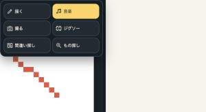

# 共通キャンバスの実装・検証記録

2026-09-30。ユーザーの「写真・ドット絵・音楽を同じ画素数・色数・Uint8Arrayで扱う」「簡単な制作、最大256px」を反映したローカル実装記録。本番公開・コミット・プッシュは今回行っていない。

## IMPLEMENTED

- 新規共通PXDの正本は `main` のRGBA8 Uint8Array。1セル4byte、画像schema 2は寸法と色数だけの小さなメタデータを持つ。Draw・Music・Camera・Hidden・Jigsaw・Spot-after用の重複画像を作らない。履歴と間違い探しの変更前画像は、必要な固定版として保持する。
- 通常は長辺128px・実使用RGBA16色、特典中は256px・32色。透明色も予算に含む。未使用の描画パレットや楽器数は画像色数と別。判定は `shared-canvas-policy.mjs` に集約。
- 初期は正方形、長方形も同じ画像契約。モード切り替えで縮小・減色しない。共通サイズ変更は、比率を保つ余白付きプレビューで明示確認してから適用。変更前の保存版を保持。
- 音楽は共有画像の全行・全列を表示し、1セル1音の座標を保持。色に割り当てた楽器だけ鳴らし、新しい色は勝手に別色の楽器へ対応付けない。高さに合わせた音程対応を保存する。
- カメラは共通寸法・予算で採用時に一度画像を確定。単独入口はライブカメラ、作品入口は保存画像から撮り直し。撮影結果の「編集・遊ぶ」から同じ作品をほかのツールで開ける。音楽への撮影戻りは作品ID・版・依頼期限を検証し、別作品へ上書きしない。
- 6モード共通のプロジェクトボタン・モードメニュー・作品一覧・複製・PXD入出力。作品ごとの保存先と版競合検知を維持する。別タブと競合した編集は上書きせず、別作品として退避できる。
- もの探しの作成途中では、まだマスクを描いていない対象名も保存できる。問題確定時には厳密なマスク検証を続ける。画像・寸法変更時に古い正解やピース進捗を流用しない。
- 特典期限切れは次の拡張操作で追加を案内。開始済みの一回の撮影・ストローク・生成は完了できる。音楽は現在のループを終えて停止し、次の拡張再生を開始しない。通常の保存・取り出しは維持する。
- 旧512px・フルカラーPXDは原本・未知entryを保持して読込・保存・出力。新規上限へ合わせて編集する場合だけ明示変換する。旧main/audio等の別画像を黙って統合しない。
- 他人の公開作品の遊ぶ権限と、自分の作品の編集・画像/PXD保存権限を分離する既存チェックを保持。投稿サーバーの8〜512px・128色・512KiB受付制限は変更していない。

## ローカル検証

`node scripts/creation-suite-harness.mjs --all`: 18スイート、506件PASS、失敗・スキップ0。

共通画像は15件、PXDは71件、描画30件、音楽70件。画像の全RGBA往復、透明色予算、512pxメタデータ、矩形寸法、同じ画素の音符化、旧データ保持、競合、撮影依頼の分離を含む。

`node --test tests/ads/tool-results.test.mjs`: 4件PASS。構文確認および `git diff --check` は合格。

ローカルCodexブラウザーで確認した範囲:

- 同じ作品IDの96×128画像を描画→音楽→もの探し→ジグソー→間違い探し→カメラ→音楽へ開く。音楽は96列×128行を表示。
- 描画の1セル変更を間違い探しで1画素の候補として認識。もの探しのマスク未作成の対象名を保存・再読込。
- 音楽を持つ96×128作品を、確認プレビュー後64×64へ変更。共有画像と音楽表示を64列×64行へ更新し、旧版を保持。
- 320×568、390×844、844×390、1440×900で操作領域を確認。横向き小画面の描画パレットは横送りの1列とし、主な道具を隠さない。小さい画面で作品名・モードが重ならず、ページ自体の縦横スクロールを増やさない。短い横向き画面では補助道具に操作領域内スクロールを使う。

## UNTESTED

物理カメラの新規撮影、実機Safari、256px/32色の長時間音声性能・発熱、保存容量不足の全端末試験、本番投稿・広告配信は今回未検証。上記のローカル検証をこれらの証明にしない。受入仕様の全fixture完了も主張しない。

## 主なファイル

- `js/creation/shared-canvas-policy.mjs` / `shared-image.mjs`: 共通上限・寸法適合・減色・色数計測。
- `js/creation/pxd-project.mjs` / `pxd-draw-audio.mjs` / `pxd-puzzles.mjs`: 正本読込・保存・音楽更新・問題の版固定。
- `js/creation/project-session.mjs` / `project-workspace.mjs` / `css/project-workspace.css`: 保存競合・共通UI・明示変換。
- `js/creation/draw-page.mjs` / `audio-page.mjs` / `js/pixel-lens/app.mjs`: 各モードの接続・操作開始判定。
